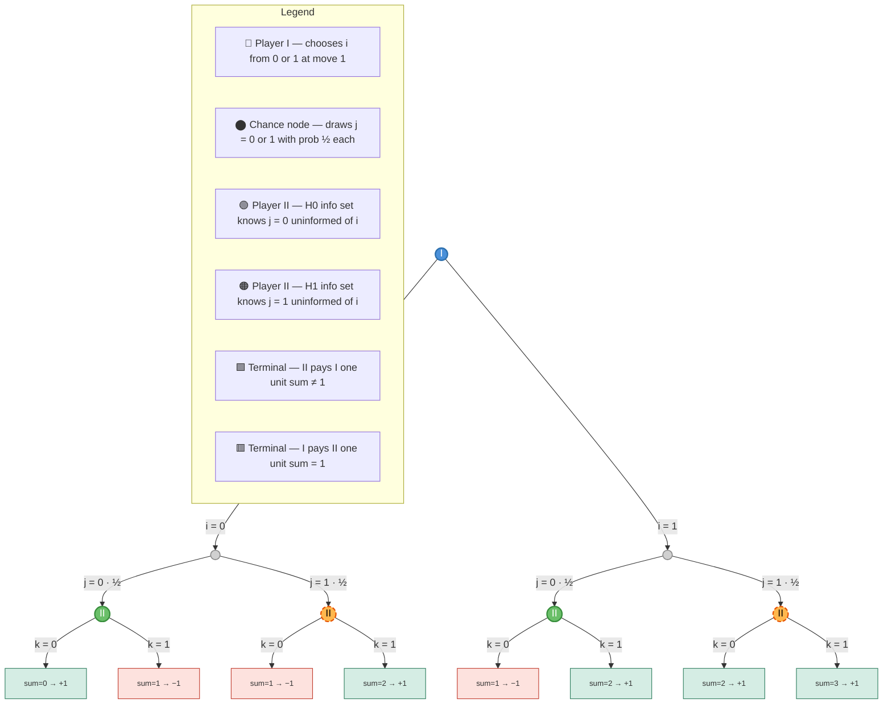

# The Game G — Parity Selection

## Game Description

This is a two-player zero-sum game involving a chance draw and binary choices across three moves.

**Move 1 — Player I:** selects one of two integers **{0, 1}**.

**Move 2 — Referee (chance):** selects one of two integers **{0, 1}** with equal probabilities **{½, ½}**.

**Move 3 — Player II:** selects one of two integers **{0, 1}**.

**Outcome:** The integers chosen in Moves 1, 2 and 3 are **summed**:
- If **i + j + k = 1** → Player I pays Player II **one unit**
- Otherwise → Player II pays Player I **one unit**

**Information of Player II at Move 3:** Player II is told the value of **j** (the chance outcome) but is **not** told the value of **i** (Player I's choice).

---

## Game Tree

> **Note on information sets:** Player II observes **j** but not **i**, yielding two information sets — one per value of j. Each information set contains two nodes (one for each possible value of i), so Player II must choose k without knowing Player I's move.
>
> - **H₀** (green): {(i=0, j=0), (i=1, j=0)} — Player II knows j=0, does **not** know i
> - **H₁** (orange dashed): {(i=0, j=1), (i=1, j=1)} — Player II knows j=1, does **not** know i

---

## Payoff Table

Payoffs shown as **(Player I, Player II)**: +1 means that player receives one unit, −1 means that player pays one unit.

| i | j | Info set | k | i+j+k | Payoff (I, II) | Result |
|:-:|:-:|:--------:|:-:|:-----:|:--------------:|:------:|
| 0 | 0 | H₀ | 0 | 0 | **(+1, −1)** | II pays I |
| 0 | 0 | H₀ | 1 | 1 | **(−1, +1)** | I pays II |
| 0 | 1 | H₁ | 0 | 1 | **(−1, +1)** | I pays II |
| 0 | 1 | H₁ | 1 | 2 | **(+1, −1)** | II pays I |
| 1 | 0 | H₀ | 0 | 1 | **(−1, +1)** | I pays II |
| 1 | 0 | H₀ | 1 | 2 | **(+1, −1)** | II pays I |
| 1 | 1 | H₁ | 0 | 2 | **(+1, −1)** | II pays I |
| 1 | 1 | H₁ | 1 | 3 | **(+1, −1)** | II pays I |

> **Payoff rule:** i + j + k = 1 → I pays II one unit. All other sums (0, 2, 3) → II pays I one unit.

---

## Information Sets

| Player | Info Set | Nodes Included | Known to II | Hidden from II |
|:------:|:--------:|:---------------|:-----------:|:--------------:|
| I | Singleton | Root node only | — | — |
| II | **H₀** | (i=0, j=0), (i=1, j=0) | j = 0 | **i unknown** |
| II | **H₁** | (i=0, j=1), (i=1, j=1) | j = 1 | **i unknown** |

Player II has **two information sets**, each containing **two nodes** — one for each value of i. Since i is unobserved, Player II's strategy is a mapping from {j=0, j=1} to {k=0, k=1}, giving **four pure strategies** in total: (k|j=0, k|j=1) ∈ {(0,0), (0,1), (1,0), (1,1)}.

---

## Node Key

| Style | Node Type | Player | Action Space |
|:-----:|:---------:|:------:|:------------:|
| 🔵 Blue circle | Decision node | Player I | Chooses i ∈ {0, 1} |
| ⚫ Grey circle | Chance node | Referee | Draws j ∈ {0, 1} with prob ½ each |
| 🟢 Green circle | Decision node | Player II — H₀ | Chooses k ∈ {0, 1}, knows j = 0, not i |
| 🟠 Orange dashed circle | Decision node | Player II — H₁ | Chooses k ∈ {0, 1}, knows j = 1, not i |
| 🟩 Green rectangle | Terminal node | — | sum ≠ 1 → II pays I one unit |
| 🟥 Red rectangle | Terminal node | — | sum = 1 → I pays II one unit |
