# Extensive-Form Game Tree

## Game Description

**Player I** moves first and selects one of two integers **{1, 2}**.  
The **referee** tosses a coin:
- **Head** → Player II is *informed* of Player I's choice (singleton information set)
- **Tail** → Player II is *not informed* (shared information set)

**Player II** then selects an integer from **{3, 4}**.  
The **referee** draws a final integer from **{1, 2, 3}** with probabilities **{0.4, 0.2, 0.4}**.

The three chosen integers are **summed**:
- **Even sum** → Player II pays Player I that amount (in dollars)
- **Odd sum** → Player I pays Player II that amount (in dollars)

---

## Game Tree

```mermaid
graph TD

    %% ═══════════════════════════════════════
    %% ROOT — Player I
    %% ═══════════════════════════════════════
    I((I))
    I -->|2| CL(( ))
    I -->|1| CR(( ))

    %% ═══════════════════════════════════════
    %% COIN FLIP — Chance nodes
    %% ═══════════════════════════════════════
    CL -->|"Head · 0"| II_2H((II))
    CL -->|"Tail · 0"| II_2T((II))
    CR -->|"Tail · 0"| II_1T((II))
    CR -->|"Head · 0"| II_1H((II))

    %% ═══════════════════════════════════════
    %% PLAYER II → REFEREE CHANCE NODES
    %% ═══════════════════════════════════════
    II_2H -->|4| F_2H4(( ))
    II_2H -->|3| F_2H3(( ))
    II_2T -->|4| F_2T4(( ))
    II_2T -->|3| F_2T3(( ))
    II_1T -->|4| F_1T4(( ))
    II_1T -->|3| F_1T3(( ))
    II_1H -->|4| F_1H4(( ))
    II_1H -->|3| F_1H3(( ))

    %% ═══════════════════════════════════════
    %% TERMINAL PAYOFFS
    %% Label format: chance-pick · probability
    %% ═══════════════════════════════════════

    %% I=2, Head, II=4  →  sums: 9, 8, 7
    F_2H4 -->|"3 · 0.4"| T1[9]
    F_2H4 -->|"2 · 0.2"| T2[8]
    F_2H4 -->|"1 · 0.4"| T3[7]

    %% I=2, Head, II=3  →  sums: 8, 7, 6
    F_2H3 -->|"3 · 0.4"| T4[8]
    F_2H3 -->|"2 · 0.2"| T5[7]
    F_2H3 -->|"1 · 0.4"| T6[6]

    %% I=2, Tail, II=4  →  sums: 9, 8, 7
    F_2T4 -->|"3 · 0.4"| T7[9]
    F_2T4 -->|"2 · 0.2"| T8[8]
    F_2T4 -->|"1 · 0.4"| T9[7]

    %% I=2, Tail, II=3  →  sums: 8, 7, 6
    F_2T3 -->|"3 · 0.4"| T10[8]
    F_2T3 -->|"2 · 0.2"| T11[7]
    F_2T3 -->|"1 · 0.4"| T12[6]

    %% I=1, Tail, II=4  →  sums: 8, 7, 6
    F_1T4 -->|"3 · 0.4"| T13[8]
    F_1T4 -->|"2 · 0.2"| T14[7]
    F_1T4 -->|"1 · 0.4"| T15[6]

    %% I=1, Tail, II=3  →  sums: 7, 6, 5
    F_1T3 -->|"3 · 0.4"| T16[7]
    F_1T3 -->|"2 · 0.2"| T17[6]
    F_1T3 -->|"1 · 0.4"| T18[5]

    %% I=1, Head, II=4  →  sums: 8, 7, 6
    F_1H4 -->|"3 · 0.4"| T19[8]
    F_1H4 -->|"2 · 0.2"| T20[7]
    F_1H4 -->|"1 · 0.4"| T21[6]

    %% I=1, Head, II=3  →  sums: 7, 6, 5
    F_1H3 -->|"3 · 0.4"| T22[7]
    F_1H3 -->|"2 · 0.2"| T23[6]
    F_1H3 -->|"1 · 0.4"| T24[5]

    %% ═══════════════════════════════════════
    %% STYLING
    %% ═══════════════════════════════════════

    style I fill:#4a90d9,color:#fff,stroke:#2c6fad,stroke-width:2px

    style CL fill:#d0d0d0,stroke:#888,stroke-width:1.5px
    style CR fill:#d0d0d0,stroke:#888,stroke-width:1.5px

    style II_2H fill:#6abf69,color:#fff,stroke:#388e3c,stroke-width:2px
    style II_1H fill:#6abf69,color:#fff,stroke:#388e3c,stroke-width:2px

    style II_2T fill:#ffb74d,color:#000,stroke:#e65100,stroke-width:2px,stroke-dasharray:6 3
    style II_1T fill:#ffb74d,color:#000,stroke:#e65100,stroke-width:2px,stroke-dasharray:6 3

    style F_2H4 fill:#fff,stroke:#555,stroke-width:1px
    style F_2H3 fill:#fff,stroke:#555,stroke-width:1px
    style F_2T4 fill:#fff,stroke:#555,stroke-width:1px
    style F_2T3 fill:#fff,stroke:#555,stroke-width:1px
    style F_1T4 fill:#fff,stroke:#555,stroke-width:1px
    style F_1T3 fill:#fff,stroke:#555,stroke-width:1px
    style F_1H4 fill:#fff,stroke:#555,stroke-width:1px
    style F_1H3 fill:#fff,stroke:#555,stroke-width:1px

    classDef leaf fill:#f5f5f5,stroke:#bbb,font-size:12px
    class T1,T2,T3,T4,T5,T6,T7,T8,T9,T10,T11,T12 leaf
    class T13,T14,T15,T16,T17,T18,T19,T20,T21,T22,T23,T24 leaf

    subgraph Legend["Legend"]
        direction LR
        LG1[🔵 Player I]
        LG2[⬤ Chance node — coin flip]
        LG3[🟢 Player II Head — singleton info set]
        LG4[🟠 Player II Tail — shared info set dashed]
        LG5[⬜ Referee chance node — picks 1 / 2 / 3]
    end
```

---

## Payoff Table

| Player I | Coin | Player II | Referee draws 3 (p=0.4) | Referee draws 2 (p=0.2) | Referee draws 1 (p=0.4) |
|:--------:|:----:|:---------:|:-----------------------:|:-----------------------:|:-----------------------:|
| 2 | Head | 4 | **9** | **8** | **7** |
| 2 | Head | 3 | **8** | **7** | **6** |
| 2 | Tail | 4 | **9** | **8** | **7** |
| 2 | Tail | 3 | **8** | **7** | **6** |
| 1 | Tail | 4 | **8** | **7** | **6** |
| 1 | Tail | 3 | **7** | **6** | **5** |
| 1 | Head | 4 | **8** | **7** | **6** |
| 1 | Head | 3 | **7** | **6** | **5** |

> Payoffs are absolute dollar amounts. **Even sum** → II pays I. **Odd sum** → I pays II.

---

## Node Key

| Style | Node Type | Meaning |
|-------|-----------|---------|
| 🔵 Blue circle | Player I | Chooses integer from {1, 2} |
| ⚫ Grey circle | Chance node | Coin flip (Head / Tail) |
| 🟢 Green circle | Player II — Head | Informed of Player I's move (singleton info set) |
| 🟠 Orange dashed circle | Player II — Tail | Uninformed (shared information set) |
| ⚪ White circle | Referee chance node | Draws from {1, 2, 3} with probs {0.4, 0.2, 0.4} |
| ⬜ Rectangle | Terminal node | Final payoff (dollar amount) |
